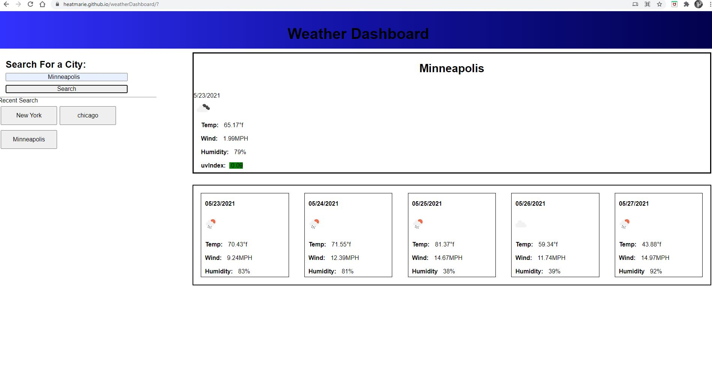

# weatherDashboard
Because we all need to see how wrong the weather man is going to be.

## The Assignment
 
 Create A weather app that does the following 

 - Allows the user to search for a city 
 - Displays current and future conditions for that city including: 
    * temperature
    * humidity 
    * wind speed 
    * UV index
        - The UV Index has a color indactor that shows if the conditions are favorable, moderate or severe.
 - Few a 5-day forcast that displays:
    * date
    * an icon representation of weather conditions
    * temperature
    * wind speed
    * humidity
- When clicking on a city in search history the user again is able to view those weather conditions.  

## Link to the Website

https://heatmarie.github.io/weatherDashboard/

   

## Comments

This app taught me something, something very important. When you think you are almost done, you will have twelve hundred miles to go. In other words, don't think that just because the first bit came easy that the rest of it will do that same. 

I still need - very badly- to work on looping through classes. It would clean up the code ALOT! It makes me wish there was more time in a day. 

Using both the OWM API and Luxon to get the currect date, was a fun experience. It took that plug and chug method until I finally got what I was looking for. 

Through this assignment I realized that arrays are not the pure evil sent to destroy my life like I believed earlier. It took us time to get along, and we still fight constantly, but we have developed a type of love hate relationship that will continue for years to come. 

The future of this app, will come with a cleaner IU, descriptions, and weather alerts. I mean, why not implement all the API has to offer.

## Technologies Used
- JavaScript
- Luxon
- HTML5
- CSS 

## Contact Information 

Heather Bjoin 

h.m.bjoin@gmail.com

